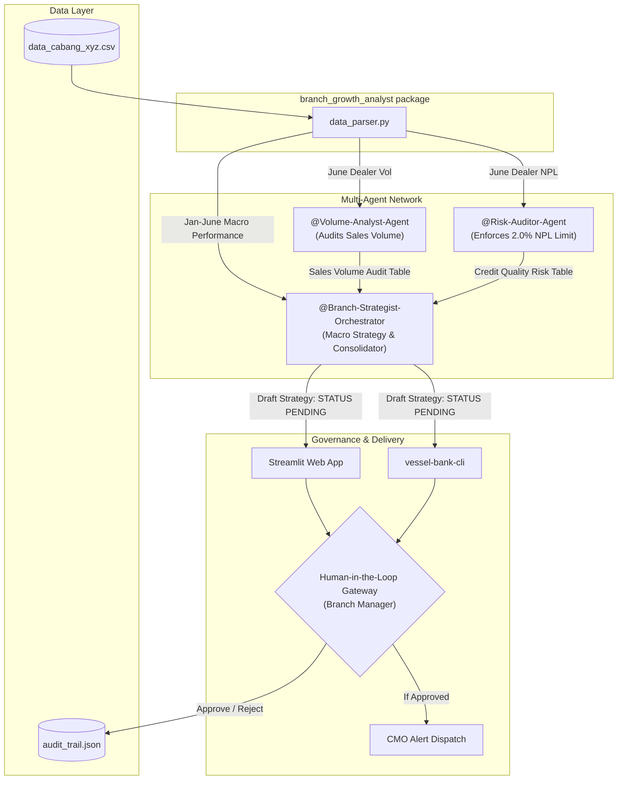

# System Architecture

This document details the software design, data flows, and multi-agent topology of the **Vessel Bank - Enterprise Branch Growth Strategy Suite**.

## System Overview

The system operates as a decision support pipeline for Used Car Financing Branch Managers. It uses a structured multi-agent workflow to audit branch performance, detect bottlenecks, mitigate credit risk, and draft operational response strategies.

---

## Component Breakdown

### 1. Data Layer
- **`data_cabang_xyz.csv`**: Semicolon-separated CSV containing monthly branch achievements, targets, NPL ratios, marketing staff levels, and detailed showroom breakdowns.
- **`audit_trail.json`**: An immutable local audit log capturing all manager approvals and rejections with timestamps.

### 2. Processing Package (`branch_growth_analyst`)
- **`data_parser.py`**: A unified parser designed to handle regional localization details (Indonesian formatting like dots for thousands and commas for decimal percentage strings) and clean it for model ingestion.

### 3. Agent Topology
The network consists of three specialized roles cooperating in a pipeline:
1. **`@Volume-Analyst-Agent`**: Inspects showroom booking volumes to identify top performers (A-grade showrooms eligible for loyalty incentives) and bottom performers (underperforming showrooms needing partnership reviews).
2. **`@Risk-Auditor-Agent`**: Evaluates Non-Performing Loan (NPL) rates to safeguard credit quality. Enforces a strict 2.0% maximum NPL tolerance limit.
3. **`@Branch-Strategist-Orchestrator`**:
   - Performs macro-analysis linking sales declines to operational resource changes (e.g. staff count drops from 8 to 6).
   - Consolidates recommendations from the Volume and Risk agents.
   - Generates the final evaluation report locked under a **`[STATUS: WAITING HUMAN APPROVAL]`** flag.

### 4. Human-in-the-Loop (HITL) Governance
To maintain high safety standards and zero ambient authority:
- The system is blocked from executing external writes (e.g. database updates or email alerts) without physical approval.
- The Streamlit Dashboard serves as a visual gatekeeper. A manager review writes approvals to the audit log and triggers dispatch routines (e.g., notifying CMOs of approved budgets).
