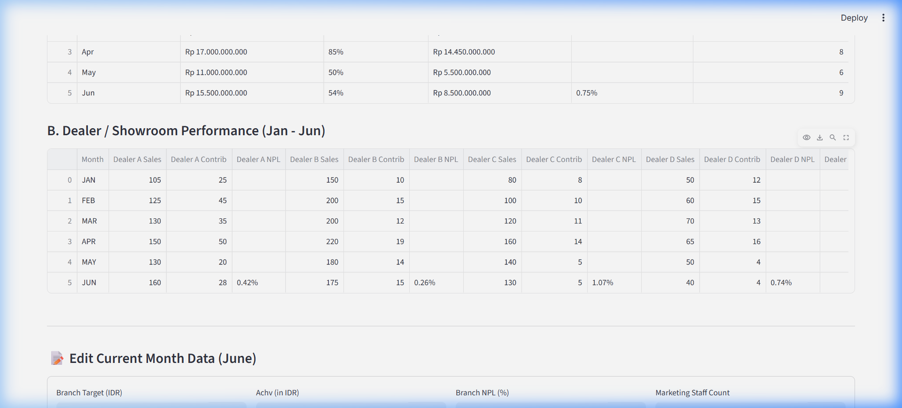
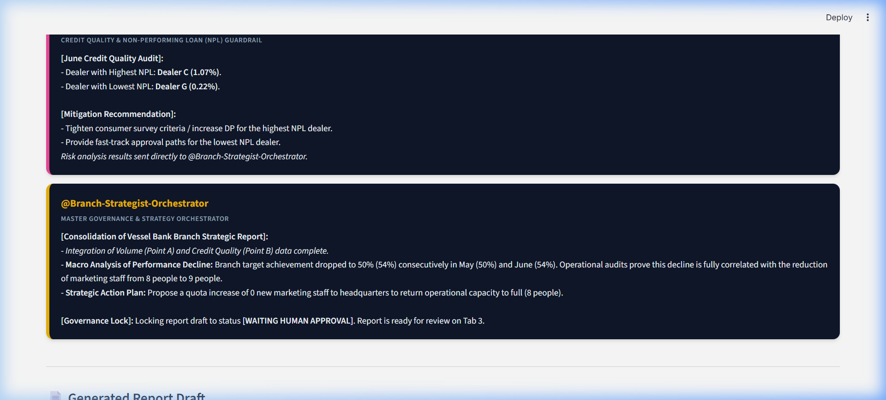
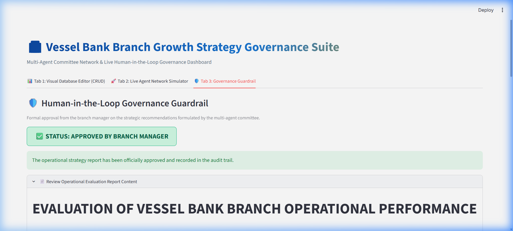

# Vessel Bank — Enterprise Multi-Agent Growth Strategy Suite

[](https://www.python.org/)
[](./LICENSE)
[](http://localhost:8501)
[](https://github.com/ggerrio/enterprise-branch-growth-agents/actions)

**Vessel Bank Enterprise Multi-Agent Growth Strategy Suite** is an intelligent decision-support platform designed to help Branch Managers and Retail Operations Directors evaluate partner showrooms, mitigate credit risk (NPL), and optimize marketing staff productivity. 

---

## 📺 Dashboard Showcase

### 1. Visual CRUD Editor

*Real-time branch data entry and automatic performance calculations.*

### 2. Multi-Agent Negotiation Simulator

*Collaborative debate between `@Volume-Analyst-Agent`, `@Risk-Auditor-Agent`, and `@Branch-Strategist-Orchestrator`.*

### 3. Human-in-the-Loop Governance Portal

*Secured operational control requiring physical sign-off from the Branch Manager before program release.*

---

## ✨ Key Features
- **Visual Database Editor (CRUD Panel):** Real-time showroom sales and credit metrics management with instant visual totals recalculation.
- **Collaborative Multi-Agent Debate Simulation:** Orchestrates three distinct agents running localized business rule logic:
  - **`@Volume-Analyst-Agent`**: Audits sales contribution data to identify top-performing partners and reviews bottom-performing bottlenecks.
  - **`@Risk-Auditor-Agent`**: Audits credit quality and enforces a strict credit risk (NPL) ceiling of **2.0%** to prevent bad credit leakage.
  - **`@Branch-Strategist-Orchestrator`**: Correlates macro-performance drops with marketing staff fluctuations and synthesizes tactical strategy reports.
- **Human-in-the-Loop (HITL) Guardrail:** Intercepts high-stakes actions (promotional fund allocations) and blocks autonomous database commits or notifications until approved by a human administrator.
- **Observability Audit Trail:** Logs all approvals and rejections with cryptographically sound timestamps to `audit_trail.json` for historical compliance tracking.

---

## 🛠️ Quickstart

### Local Setup
1. **Clone the repository:**
   ```bash
   git clone https://github.com/ggerrio/enterprise-branch-growth-agents.git
   cd enterprise-branch-growth-agents
   ```

2. **Initialize and activate virtual environment:**
   ```bash
   python -m venv .venv
   source .venv/bin/activate  # On Windows: .venv\Scripts\activate.ps1
   ```

3. **Install the package and dependencies:**
   ```bash
   pip install -r requirements.txt
   ```

### Running the App & CLI
- **Launch the Streamlit Web Application:**
  ```bash
  streamlit run app.py
  ```
- **Run the CLI Agent Simulator:**
  ```bash
  vessel-bank-simulate
  ```
- **Run the June Evaluation Report Generator:**
  ```bash
  vessel-bank-evaluate
  ```
- **Run the Interactive Governance Suite:**
  ```bash
  vessel-bank-governance
  ```

---

## 📊 Example Output
Below is an excerpt of the automatically generated report `Laporan_Evaluasi_Operasional_Juni.md` awaiting manager sign-off:

```markdown
# EVALUATION OF VESSEL BANK BRANCH OPERATIONAL PERFORMANCE - JUNE
[STATUS: WAITING HUMAN APPROVAL]

### **POINT A: Dealer Unit Contribution (June)**
* **Best Contributor Dealer:** Dealer A (Contribution: 21 Units)
  * *Recommended Action:* Provide appreciation in the form of an exclusive loyalty program.
* **Worst Contributor Dealer:** Dealer E, G, and H (Contribution: 1 Unit each)
  * *Recommended Action:* Conduct a comprehensive partnership review.

### **POINT B: Credit Risk / Non-Performing Loan (NPL) Analysis (June)**
* **Highest NPL Dealer:** Dealer C (NPL Percentage: 1.07%)
  * *Recommended Action:* Tighten survey criteria and increase the consumer Minimum DP.
```

---

## 📂 Repository Blueprint
```
branch_growth_analyst/
├── .github/workflows/          # GitHub Actions CI configs
│   └── python-ci.yml
├── demo/                       # Visual assets & screenshots
├── src/
│   └── branch_growth_analyst/  # Core Package Implementation
│       ├── __init__.py
│       ├── data_parser.py
│       ├── cli.py
│       ├── simulate_committee.py
│       ├── run_june_evaluation.py
│       └── enterprise_governance_suite.py
├── app.py                      # Main Streamlit Dashboard Application
├── pyproject.toml              # Modern package metadata & entry points
├── requirements.txt            # Package installation manifest
├── SAFETY_GUARDS.md            # Concised security guidelines
├── SECURITY.md                 # Anonymization & credentials policies
└── ARCHITECTURE.md             # Technical design & Mermaid flowcharts
```

---

## 💼 Role & Key Learnings
- **My Role:** Architected the multi-agent network simulation, designed the local localized CSV parser with regional formatting tolerances, built the Streamlit visual CRUD and debate interface, and enforced the Zero-Ambient-Authority HITL guardrail.
- **Key Learnings:** 
  - Designed client-side security policies enforcing human authorization gates for high-stakes business operations.
  - Implemented regionalized number format cleaners (Indonesian decimal and thousands separation) to avoid LLM formatting errors.
  - Standardized modern Python package structures (src/ layouts) with console entry points and automated pytest configurations.
